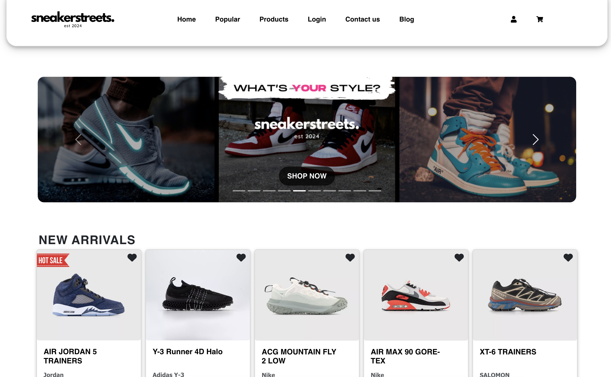
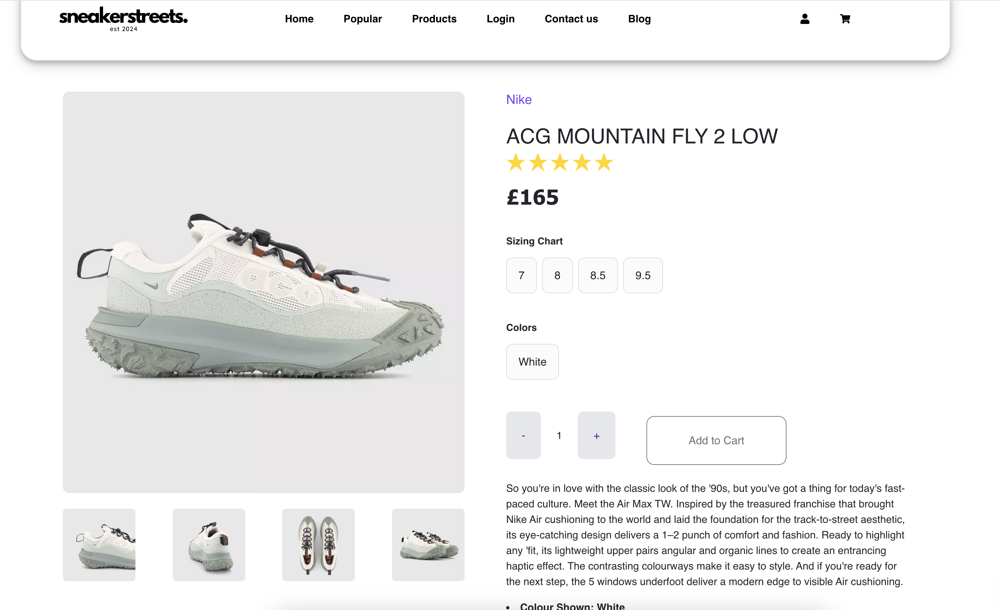

# SneakerStreets
  [](https://opensource.org/licenses/MIT)

  ## Description
  SneakerStreets is Ecommerce platform to purchase your faviourate sneakers.

  ## Table of Contents

  - [Installation](#installation)
  - [Usage](#usage)
  - [License](#license)
  - [Screenshots](#screenshots)
    - [Contributing](#contributing)
    - [Tests](#tests)
    - [Questions](#questions)

  ## Installation
  To install neccessary dependencies, run the following command:

  ``` npm i ```

  ## Usage
  SneakerStreets is still in progress and the products displayed on the website are taken from offspring.co.uk

  ## License
  The Project is under the MIT licencse.

  ## ScreenShots
  - HomePage

- Products Page

  ## Contributing
  Get in touch with the developers to contribute

  ## Tests
  To run tests, run the following command:

  ``` npm test ```

  ## Questions
  If you have any questions about the repo, open an issue or contact me directly at [gsgghotra@gmail.com](mailto:gsgghotra@gmail.com). You can find more of my work at [smntsng](https://github.com/smntsng).

